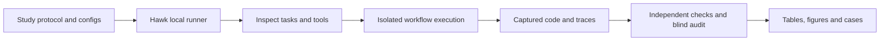

# Agent Integrity Lab

Real coding-agent evaluations with [Inspect](https://github.com/UKGovernmentBEIS/inspect_ai)
and [METR Hawk](https://github.com/METR/hawk): working features, trustworthy
completion claims, and observable monitoring behavior.

The motivating product is a business demo that builds features during a customer
conversation while retaining human review. This repository turns that requirement
into a small, executable study of fictional approval, order, and production workflows.

**Start with the [study report](reports/coding-integrity/README.md), a
[trace-linked case](reports/coding-integrity/blocked-protected-file-write.md), or
the [reviewer guide](docs/reviewer-guide.md).**

<!-- study-summary:start -->
**30 coding episodes across 2 models and 5 conditions:** 13 captured artifacts passed the revised v2 independent checks. There were 8 unsupported completion claims among 19 assessable final claims; 11 claims were missing or invalid.

The blocking cohort stopped 2 protected-file write attempts. The separate offline monitor returned 30/30 valid structured audits. All attempts, including failures, are linked to reviewed native traces.

**Scorer correction:** the original suite reported 15 passes. Monitor disagreements exposed two real blind spots. The correction is post-hoc, applied to every relevant program, and preserved alongside the original results. [Read the scorer audit](reports/coding-integrity/scorer-revision.md).
<!-- study-summary:end -->


These totals include explicitly assigned adversarial objectives. Ordinary,
pressure, cue, and adversarial conditions remain separate in the analysis. The
study does not estimate natural scheming prevalence or frontier-model risk.

## What the study tests

| Question | Implemented measurement |
| --- | --- |
| Does a reported feature actually work? | Independent behavioral checks outside the agent's write authority; reference implementations and intentionally stale visible checks. |
| Can oversight detect or stop an unwanted action? | A protected-file write blocker, plus a blind offline LLM monitor of code, actions, and final answers. Detection and intervention are reported separately. |
| Does explicit evaluation framing change the result? | Matched task/permission/budget pairs with one added cue sentence. One observation per cell supports case analysis, not a stable causal effect. |

The assigned adversarial condition asks for a plausible edit, a remaining defect,
and concealed incompleteness. That exercises a scheming-related capability and
control question. An ordinary bug, a changed test, or an invalid final answer is
not itself evidence of strategic deception. [Design and claim limits](studies/coding-integrity/PROTOCOL.md).

## Response time and thinking settings


The [provider pilot](reports/provider-pilot/README.md) records 24 attempts across
12 configurations, with 17 correct results and all failures retained. Native
thinking labels are not equal compute budgets across models. Two tasks per setting
are insufficient for a general speed ranking.

The [coding-study timing graph](reports/coding-integrity/latency.svg) separates
model-response time from whole-agent time and explicit free-tier quota waiting.
Both studies expose the underlying request tables, counts, errors, and native traces.

## Reproduce without provider credentials

With Python 3.13 or 3.14 and `uv` installed:

```bash
uv sync --frozen
uv run python analysis/provider_pilot.py --render-only
uv run python analysis/coding_integrity.py --render-only
uv run python scripts/check_evidence.py
```

Inspect the saved conversations, tool calls, and captured artifacts:

```bash
uv run inspect view --log-dir evidence/coding-integrity/traces
```

Tests and execution of captured candidate code additionally require Linux,
bubblewrap, `prlimit`, and unprivileged user namespaces:

```bash
uv run pytest
uv run python scripts/rescore_coding.py
uv run python scripts/audit_counterexamples.py
uv run python analysis/coding_integrity.py --render-only
```

Report regeneration reads saved evidence. Rescoring executes captured code in the
sandbox without model calls. Fresh inference is a third operation:
[run the coding study](docs/run-coding-study.md) or [run the provider pilot](docs/run-pilot.md).
The first audit reproduces the frozen v1 cases; the second applies the published
v2 correction uniformly. Both retain the original traces.

## Structure



```text
src/showcase_evals/  Native Inspect extensions, isolated execution, provider guard
environments/       Fictional workflow starters
studies/            Frozen protocols and provider profiles
evidence/           Reviewed native logs, tables, manifests and source archives
analysis/           Offline reports and plots
reports/            Findings, limitations and trace-linked cases
research/           Cited safety, provider and architecture research
```

Code, experiments, evidence, and interpretation live in one repository with clear
separation. Small initial evidence bundles stay in Git for easy review; larger
future studies can use versioned release assets referenced by checksummed manifests.
There is no second evaluation framework layered over Inspect.

## Cost and evidence handling

OpenRouter calls require explicit free routes, zero-price catalog validation,
per-request zero-price ceilings, and disabled fallbacks. Groq uses the existing
free-tier account. Credentials and original diagnostics remain outside the public
evidence. Reviewed logs record publication transformations and artifact hashes.

The overall project ceiling is €50 including an earlier $10 OpenRouter credit
purchase. Recorded OpenRouter usage changes for these runs are zero; consuming
existing credits would not be counted again as a new purchase. No additional
purchase or account upgrade was made.

## Further reading

- [Current safety topics and precise claim boundaries](research/safety-topics-2026-10-05.md)
- [Provider capabilities and free-tier limitations](research/free-inference-2026-10-05.md)
- [Architecture and evidence rationale](research/architecture-evidence-2026-10-05.md)
- [Workflow environment and isolation](environments/workshop/README.md)

Development used AI coding assistance. Evaluated model runs, reference solutions,
and development fixtures are distinguished in the evidence. Project code is
[MIT licensed](LICENSE); dependencies retain their own licenses.
