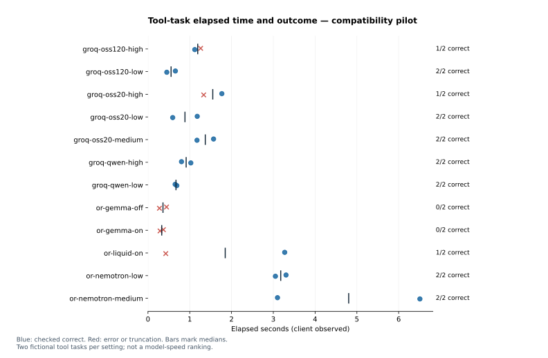

# Provider compatibility and timing pilot — 2026-10-06

**24 attempted tool tasks across 12 configurations; 17 checked correct.** This is a compatibility pilot, not the coding-agent safety study or a production-performance benchmark.

Model inference ran through Hawk 3.6.0's local evaluation runner and Inspect 0.3.276. Each sample read a fictional order through a Python tool and returned a checked calculation and approval decision. No message left the fixture.




| Configuration | Correct / attempted | Median task seconds | Observed failures |
| --- | ---: | ---: | --- |
| `groq-oss120-high` | 1/2 | 1.191 | tool_protocol_error |
| `groq-oss120-low` | 2/2 | 0.553 | — |
| `groq-oss20-high` | 1/2 | 1.551 | output_truncated |
| `groq-oss20-low` | 2/2 | 0.886 | — |
| `groq-oss20-medium` | 2/2 | 1.372 | — |
| `groq-qwen-high` | 2/2 | 0.914 | — |
| `groq-qwen-low` | 2/2 | 0.671 | — |
| `or-gemma-off` | 0/2 | 0.359 | rate_limit |
| `or-gemma-on` | 0/2 | 0.329 | rate_limit |
| `or-liquid-on` | 1/2 | 1.849 | rate_limit |
| `or-nemotron-low` | 2/2 | 3.177 | — |
| `or-nemotron-medium` | 2/2 | 4.804 | — |

## Interpretation and limits

Recorded failure categories: {'output_truncated': 1, 'rate_limit': 5, 'tool_protocol_error': 1}. A completed Hawk evaluation set can still contain sample errors; the table counts individual samples, not the runner's exit code.

Rate-limit failures establish an availability problem during these requests; they do not establish whether account quota or upstream capacity caused it. Tool-protocol errors and output truncation are separate failure classes. The 1,024-token completion cap includes reasoning where the provider counts it; a truncated high-effort response is not evidence that the model cannot solve the task.

These are two observations per configuration on very small tasks, with no independent replication, randomized comparison, confidence intervals, or stable tail-latency estimate. Request counts can differ when a task fails. The response figure excludes unsuccessful requests explicitly; the task figure includes failures. Do not read fast error returns as successful model performance.

Thinking labels are provider controls, not matched compute. Groq Qwen's requested high maps to native xhigh in the documented interface. Input/output length, cache behavior, routing, network conditions, and server load affect elapsed times. No first-token or hidden-thinking duration was measured.

OpenRouter key usage changed by **$0.000000** across the recorded batches. Groq ran on the supplied free-tier account; its request responses are not a billing ledger. No additional purchase or upgrade was made. The owner's earlier $10 credit purchase is separate from these inference usage measurements.

## Evidence and reproduction

- [Protocol](../../studies/provider-pilot/PROTOCOL.md)
- [Profile definitions](../../studies/provider-pilot/profiles.json)
- [Sample data](../../evidence/provider-pilot/samples.csv)
- [Request data](../../evidence/provider-pilot/requests.csv)
- [Trace manifest, hashes and publication transformations](../../evidence/provider-pilot/data.json)

The compact reviewed pilot `.eval` logs are kept with this initial evidence set. Future larger studies will use versioned release bundles. Original diagnostic tracebacks remain private; publication transformations are recorded in the manifest.

Regenerate this report and its figures without credentials or new inference:

```bash
uv sync --frozen
uv run python analysis/provider_pilot.py --render-only
```
